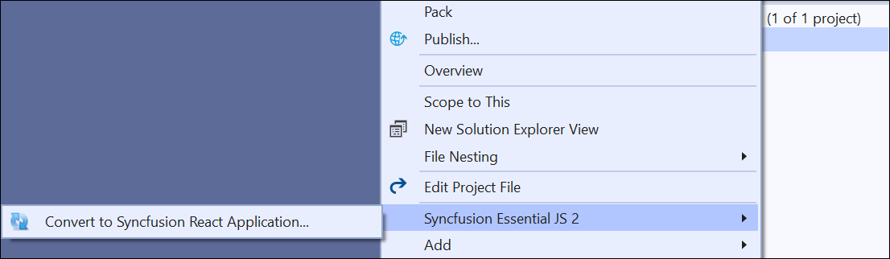
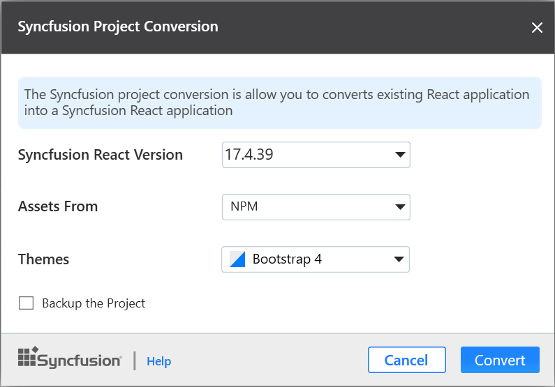
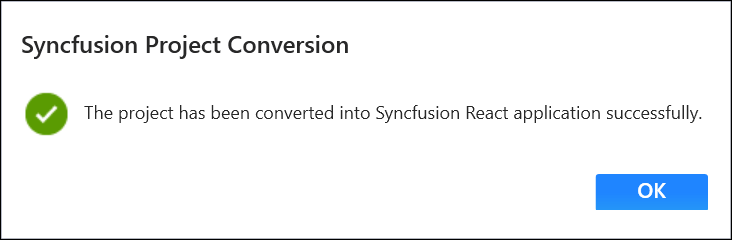

# Convert Project

Syncfusion React conversion is a Visual Studio add-in that converts an existing React application into at Syncfusion React application

> The Syncfusion React Project conversion are available from v17.3.0.9.

The following steps help you to convert the  **React application** to **Syncfusion React application** through the **Visual Studio:**

1. Open the existing React application.

2. To open Syncfusion Project Conversion Wizard, follow either one of the options below:

    **Option 1:**

    **Choose Extensions-> Syncfusion-> Essential Studio for ASP.NET Core ->Convert Project� in Visual Studio 2019 menu.**

     

    **Option 2:**

    Right-click on the **Application** from the **Solution Explorer** and select the **Syncfusion Essential JS 2** and choose the **Convert to Syncfusion React application...**

     

3. The Syncfusion **Project Conversion** window appears. You can choose the required Syncfusion React version to convert. The Syncfusion React versions are loaded from published Syncfusion React NPM package versions and it requires the internet connectivity. If you want to take backup of the project, select the Backup the project. Also, you can choose themes and asset option.

     

4. Once the conversion process completed, will get the success message window.

     

## Convert changes

The Syncfusion NPM packages and selected Style link will be updated with the selected Syncfusion React version in the React application.

## Npm packages

The installed Syncfusion React NPM packages are updated with the selected Syncfusion React version in ClientApp/package.json file.

 

## CDN

The selected Syncfusion React version updated in the ClientApp/src/index.html file with a selected style link.

## NPM

The selected Syncfusion React version updated in the ClientApp/src/index.html file from npm package.

