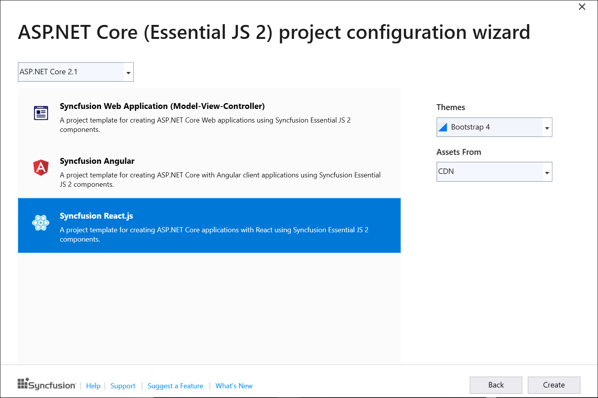

# Visual Studio Integration

## Create Project

Syncfusion provides the **Visual Studio Project Templates** for creating the Syncfusion React Application. The Syncfusion React application creates the application with the required Syncfusion references, namespaces and CDN links for making the development earlier with the Syncfusion components.

> The Syncfusion React project templates are available from v17.1.0.47.

The following steps help you to create the Syncfusion React Application through the Visual Studio:
1. Open the Visual Studio 2017 or Visual Studio 2019.
2. To create a Syncfusion React project, follow either one of the options below:

    **Option 1:**

     Choose the **Extension->Syncfusion-> Essential Studio for ASP.NET Core -> Create New Syncfusion Project… in the Visual Studio menu.**

    

    **Option 2:**

     Choose **File > New > Project in Visual Studio. The Create a new project dialog opens. You can get the Syncfusion provided templates by filtering the Project type with Syncfusion** or use the **Search option** with the key word of **Syncfusion.**

    

3. Select the **Syncfusion ASP.NET Core (Essential JS2) Web Application** and choose the Next button.

    

4. Name the **Project**, choose the destination location and then click **Create** button. The **Syncfusion ASP.NET Core (Essential JS2)**  project configuration wizard appears.

    

    Choose the **Syncfusion React.js** template and choose required theme and asset.

5. Click the Create button, the Syncfusion React application has been created.

6. The created Syncfusion React application configured with Syncfusion.

7. You can run the application and see the Syncfusion components.

### Syncfusion integration

Syncfusion adds the required latest version of Syncfusion NPM packages and Style links.

### NPM packages

The following NPM package is added in Syncfusion React application in a package.json file.

### Style links

Selected theme (while creating the project) is added based on selected assets.

If selected assets are **CDN** , style link is added to the cdn link in ClientApp/src/index.html file.

If selected assets are **NPM**, style is referred from installed npm package in ClientApp/src/index.html file.

