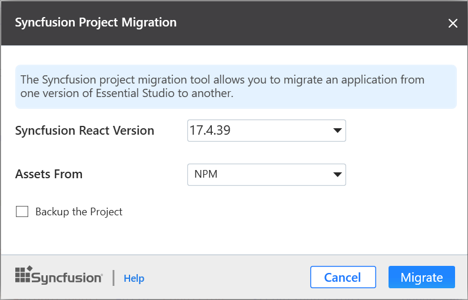
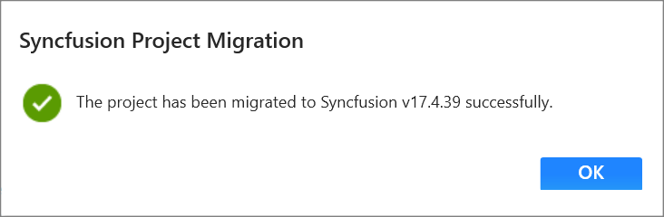
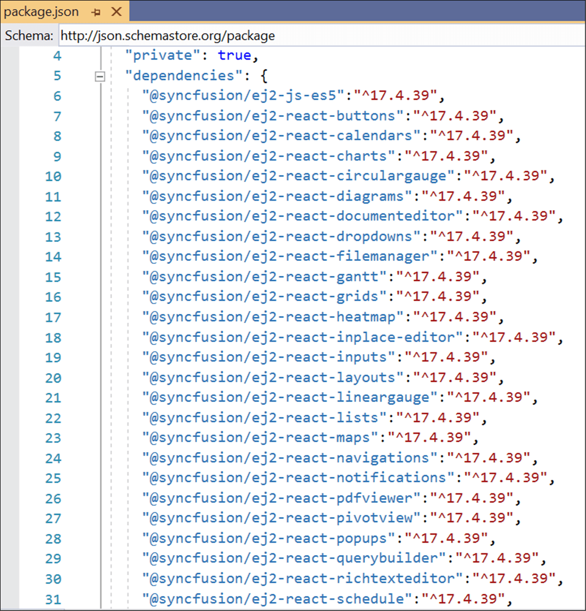
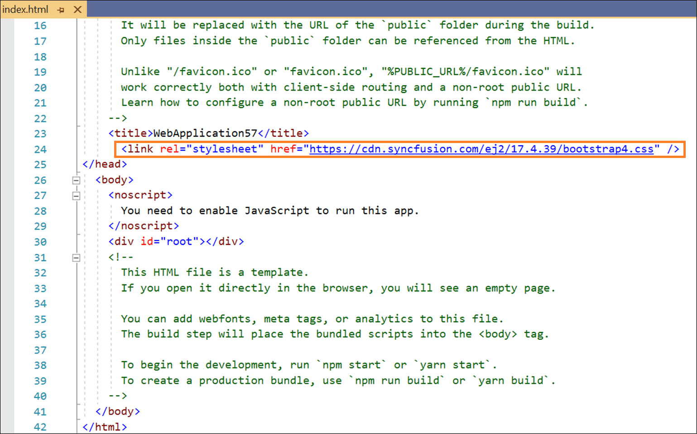

# Upgrade Project

The Syncfusion React migration is a Visual Studio add-in that allows you to migrate the existing Syncfusion React Application from one Essential Studio version to another version. This helps to avoid the manual work stuff in required places when migrating the Syncfusion version.

> The Syncfusion React Project migration are available from v17.3.0.9.

The following steps help you to upgrade the Syncfusion version in **Syncfusion React Application** through the **Visual Studio:**

1. Open the React application which uses the Syncfusion component.

2. To open Migration Wizard, follow either one of the options below:

    **Option 1**

    **Choose Extensions-> Syncfusion-> Essential Studio for Essential Studio for ASP.NET Core ->Migrate Project� in Visual Studio menu.**

      

    **Option 2**

       Right-click on the **Application** from the **Solution Explorer** and select the **Syncfusion Essential JS 2** and choose the **Migrate the Essential JS 2  project to Another version�**

       

3. The Syncfusion **Project Migration** window appears. You can choose the required Syncfusion React version to migrate. The Syncfusion React versions are loaded from published Syncfusion React NPM packages and it requires the internet connectivity. If you want to take backup of the project, select the Backup the project. Also, if you want to select asset option, select **Asset From** value.

     

4. Once the migration process completed, will get the success message window.

    

5. The Syncfusion React NPM packages, and CSS are updated to the respective version in the project.

## Upgraded changes

The Syncfusion NPM packages and Style link will be updated with the selected Syncfusion React version in the Syncfusion Project Migration.

## Npm packages

The installed Syncfusion React NPM packages are updated with the selected Syncfusion React version in the ClientApp/package.json file.

## CDN

The selected Syncfusion React version updated in the ClientApp/Public/index.html file with cdn link.

## NPM

The selected Syncfusion React version updated in the ClientApp/ Public /index.html file from npm package.

